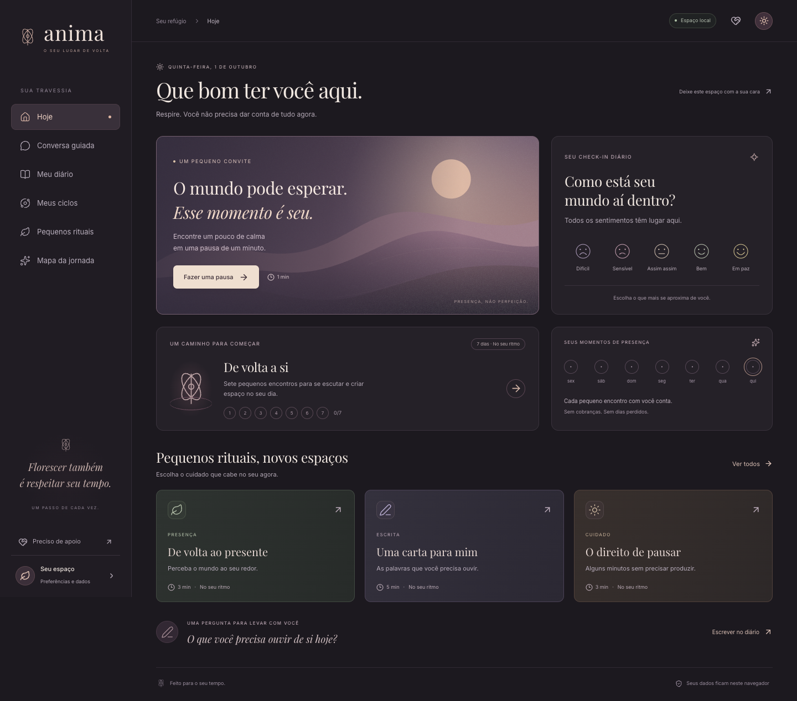

# ANIMA

Um espaço de autoconhecimento com check-in diário, escrita, rituais e ciclos de cuidado. MVP web responsivo em português, construído sobre a base Expo / React Native de [PDantas84/anima](https://github.com/PDantas84/anima).



[Ver a versão móvel](docs/preview-mobile.png) · [Relatório de validação](VALIDATION.md)

## Experimentar

Requisitos: Node.js 22.13+ e npm. Validado com Node.js 24.17 e Chrome.

```bash
npm ci
npm run dev:web
```

Para executar a versão de produção local:

```bash
npm run build:web
npm run preview
```

Abra **http://127.0.0.1:4173**. Não é necessário configurar conta, servidor ou chave de API. O servidor de prévia escuta somente neste computador.

## O que funciona

- **Hoje:** check-in com cinco sentimentos, registro por data local, presença na última semana e atalhos de cuidado.
- **Diário:** criar, ler, editar, buscar, filtrar e apagar entradas com confirmação.
- **Conversa guiada:** quatro intenções, perguntas com roteiros predefinidos, histórico temporário e gravação voluntária no diário.
- **Ciclos:** três jornadas de sete encontros distintos. Um encontro por dia, progresso persistido e releitura dos dias concluídos, sem penalizar pausas.
- **Rituais:** seis práticas com orientações, cronômetro que acompanha o tempo real, pausa, reinício, favoritos e registro de conclusão.
- **Mapa da jornada:** métricas e gráfico derivados apenas dos registros da pessoa, sem dados fictícios ou inferências clínicas.
- **Eu futuro:** carta editável, escrita pela própria pessoa.
- **Meu espaço:** nome, intenção, exportação JSON, importação validada e exclusão completa mediante confirmação.
- **Apoio:** acesso permanente a orientações para buscar ajuda humana e contatos oficiais brasileiros.

## Escopo e privacidade

Este é um **MVP local para validação do produto**. Os dados ficam em `localStorage`, sob a chave `anima.workspace.v1`, no navegador e origem usados. Não há autenticação, sincronização entre dispositivos, servidor de IA ou envio de conteúdo para serviços externos. Fontes e ilustrações são servidas pelo próprio aplicativo.

O armazenamento local **não é criptografado nem protegido por senha**. Quem usa o mesmo perfil do navegador pode ler o diário. Apagar os dados do navegador pode remover os registros; exporte um backup antes. Um backup contém o conteúdo completo do diário, portanto deve ser guardado como informação pessoal. A importação substitui os dados atuais somente após confirmação. Mudanças em outra aba são sincronizadas pelo evento `storage`; evite editar o mesmo registro simultaneamente em várias abas.

Falhas de armazenamento não geram mensagem de sucesso nem fecham o editor. Dados corrompidos não são sobrescritos automaticamente; é possível baixar o conteúdo bruto para recuperação ou apagá-lo explicitamente em Meu espaço.

A conversa oferece **roteiros de reflexão**, não IA generativa, terapia ou diagnóstico. A detecção de algumas expressões de risco é apenas uma regra local limitada, pode falhar ou acionar indevidamente e não monitora a pessoa nem chama socorro. A área de apoio está sempre disponível. Informações: [CVV](https://cvv.org.br/o-cvv/) e [SAMU 192](https://www.gov.br/saude/pt-br/composicao/saes/samu-192).

## Estrutura

```text
app/                    Rotas Expo originais e variantes .web.tsx
web/                    Interface web, estado e funcionalidades do MVP
web/components/         Janelas, controles e prática com cronômetro
web/domain/             Modelo validado, conteúdo e regras puras
public/                 Fontes locais e ilustrações SVG próprias
scripts/serve.mjs       Servidor local da exportação de produção
scripts/qa-visual.mjs   Revisão das telas em 3 tamanhos e axe-core
tests/                  Testes de domínio e fluxos com Playwright
```

As variantes `.web.tsx` usam o roteamento do Expo. A base nativa original foi preservada; iOS/Android **não receberam a nova experiência nem foram homologados nesta entrega**. O cliente Supabase foi protegido contra inicialização sem variáveis; as telas nativas continuam exigindo um backend configurado. A migração SQL original não constitui um esquema completo de instalação.

## Verificação

```bash
npm run typecheck
npm test
npm run build:web
npm run test:e2e -- --workers=2
```

Playwright usa o Chrome instalado no computador e inicia a prévia automaticamente. Para usar seu Chromium empacotado, instale-o com `npx playwright install chromium` e remova `channel: 'chrome'` em `playwright.config.ts`.

Os testes cobrem persistência após recarga, atualização do check-in, CRUD do diário, regras dos ciclos, cronômetro, favoritos, conversa, contatos de apoio, exportação/importação, dados corrompidos, falhas de gravação e foco por teclado, em desktop e celular. Os testes de domínio também cobrem virada de mês/ano e validação de backup.

Com a prévia rodando, `npm run qa:visual` inspeciona nove telas em 1440, 820 e 390 pixels, gera capturas e executa verificações automáticas WCAG A/AA. Isso complementa a revisão visual, sem representar uma auditoria completa de acessibilidade.

## Dependências e próximos passos

Foram aplicadas atualizações compatíveis com Expo SDK 54 e correções pontuais de PostCSS e UUID. A auditoria npm foi reduzida de 34 para 4 avisos: 1 alto em `image-size`, utilizado pelo Metro durante a compilação, e 3 moderados na cadeia `decode-uri-component` / `query-string` / Expo Router. Não há upload ou processamento de imagens fornecidas pelo usuário neste MVP. As versões corrigidas restantes exigem tratar mudanças de API ou atualizar o SDK; não foi aplicado `npm audit fix --force`.

Antes de uma versão pública com dados sensíveis, a próxima fase deve implementar autenticação, banco com regras de acesso por usuário, política de retenção e exclusão, revisão especializada do conteúdo e avaliação de acessibilidade. Uma IA real, se desejada, precisa de integração no servidor, credenciais protegidas e avaliação específica. A distribuição em lojas requer a evolução e validação separada da experiência nativa.

## Créditos

Base de produto: repositório ANIMA. Fontes: Inter e Playfair Display, com licenças em `public/fonts/`. Ícones: Lucide. Paisagem e marca do MVP: SVGs próprios, sem imagens remotas.
